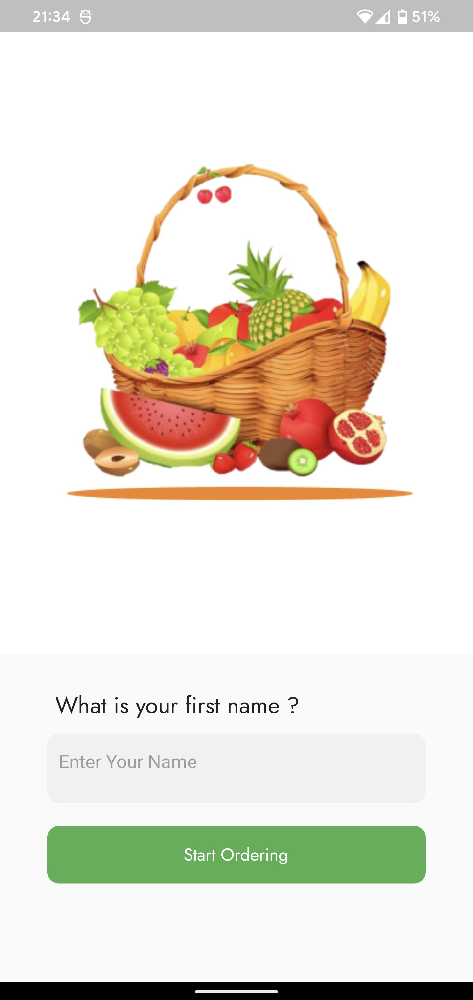
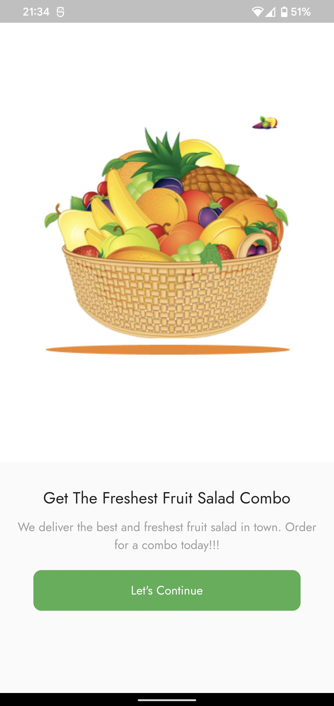
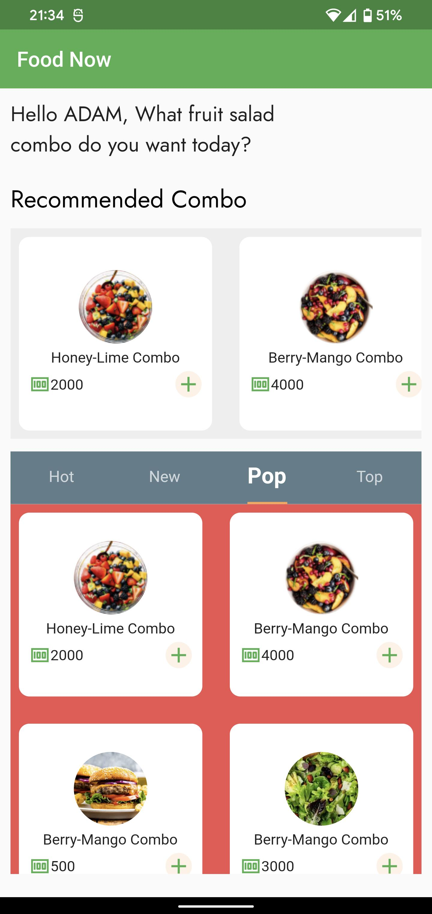
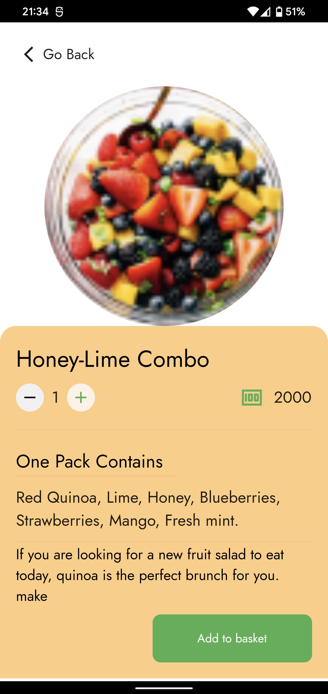
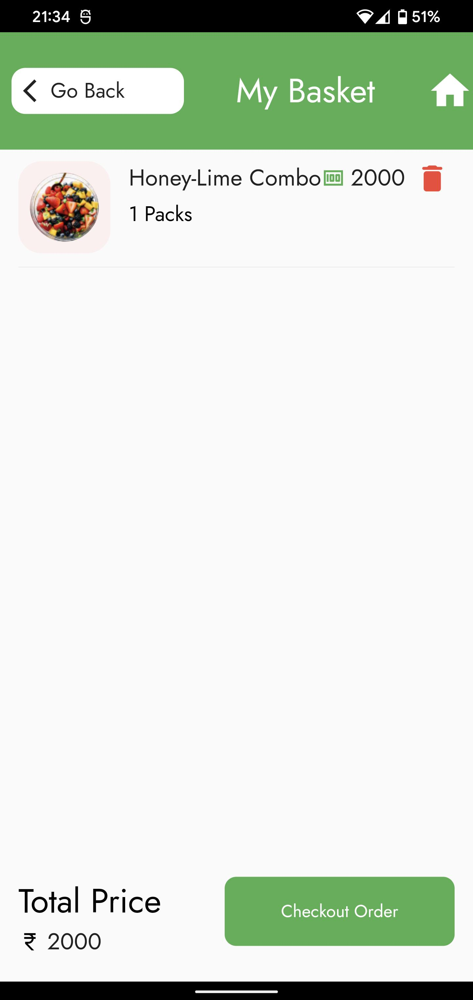
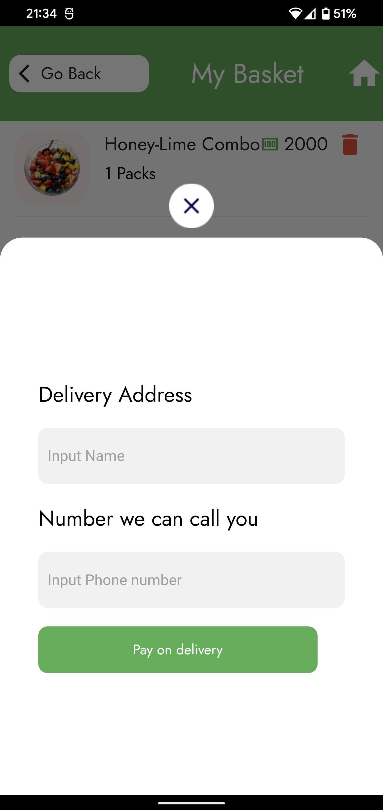
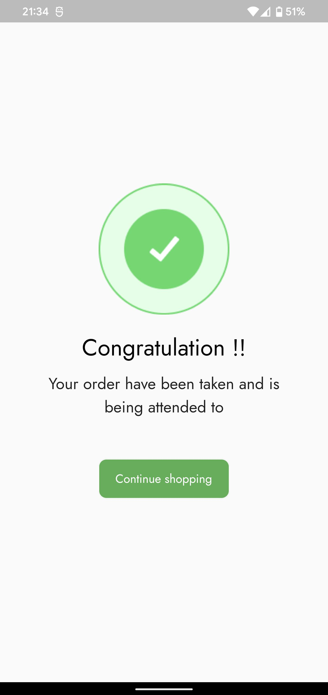

<h1 align="center"> Food Delivery </h1>  

**1.** Food Delivery

**2.** Food Delivery is a food order app

**3.** Food Delivery is a food order app. 
The first step is to enter your name.
The main screen appears and you can choose your favorite dish. Next, the detail screen for the dish you have chosen will appear, you can choose the quantity here.
Next, the detail screen for the dish you have chosen will appear, you can select the quantity here and then click the Add to basket button. At this time, the screen listing the dishes and the total amount will appear. Click the checkout order button, the address and phone number entry screen appears, you are required to enter these two information. Then click the Pay on delivery button, your food ordering process is complete.

